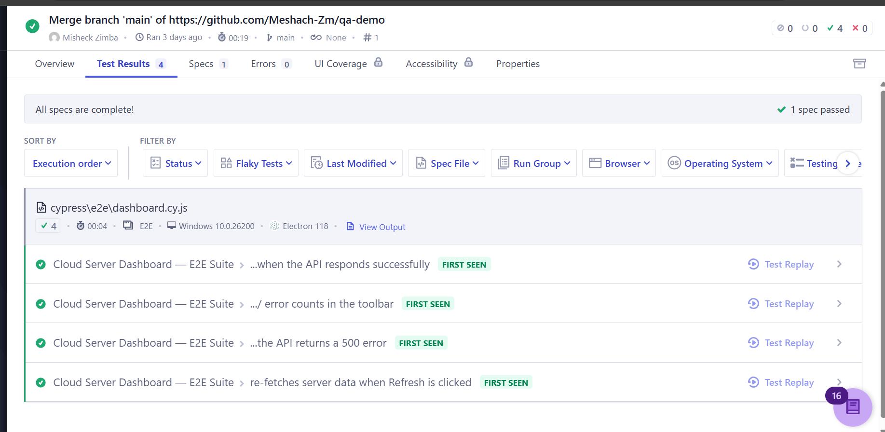

# Cloud Server Dashboard — QA Automation Proof of Work

> End-to-end and component-level automation suite demonstrating production-grade QA engineering practices using Cypress and CI integration.

---

## Overview

This project demonstrates a modern QA automation workflow applied to a small component-driven dashboard application.

It highlights:

- Deterministic API mocking using `cy.intercept()`
- Edge-case validation (500 error handling)
- Component isolation testing (Shift-Left approach)
- CI/CD integration with GitHub Actions
- Cypress Cloud test recording and observability

The goal is to showcase real-world automation practices beyond basic "happy path" testing.

---

## What This Project Demonstrates

| Requirement from JD | Implementation |
|---|---|
| Cypress E2E Testing | `cypress/e2e/dashboard.cy.js` |
| Cypress Component Testing (Shift-Left) | `cypress/component/server-card.cy.js` |
| `cy.intercept()` for API mocking | Tests 1–4 in E2E suite |
| Edge case: 500 error handling | Test: *"the API returns a 500 error"* |
| Flaky test awareness & mitigation | Documented in E2E suite comments |
| Lit component-driven UI | `src/server-card.js` |
| JavaScript (ES Modules) | Modern modular structure |
| GitHub Actions CI/CD | `.github/workflows/cypress.yml` |
| Cypress Cloud integration | Recorded CI test runs |

---

## Cypress Cloud Execution

Below is a successful test run recorded in Cypress Cloud:



**Highlights:**

- 4/4 E2E tests passing
- API success + 500 error simulation
- Refresh-triggered re-fetch validation
- CI-linked commit tracking
- Electron browser execution (Windows)
- Test Replay available for debugging

---

## Project Structure

```
levelbuild-qa-demo/
├── src/
│   ├── server-card.js        # Lit web component
│   └── main.js               # App logic (fetch + render)
├── cypress/
│   ├── e2e/
│   │   └── dashboard.cy.js   # Full E2E suite (4 tests)
│   ├── component/
│   │   └── server-card.cy.js # Component isolation tests
│   └── fixtures/
│       └── servers.json      # Mock API response data
├── docs/
│   └── cypress-cloud-dashboard.png  # Dashboard screenshot
├── .github/
│   └── workflows/
│       └── cypress.yml       # CI/CD pipeline
├── index.html
└── vite.config.js
```

---

## Running Locally

```bash
# 1. Install dependencies
npm install

# 2. Start the dev server
npm run dev

# 3. Open Cypress interactive runner
npm run cypress:open

# 4. Run all tests headlessly (CI mode)
npm run cypress:run
```

---

## Testing Strategy

### End-to-End Testing

The E2E suite validates:

- Successful API rendering
- Error state handling (500 response)
- UI refresh triggering a new fetch
- Toolbar error count validation

All network interactions are controlled using `cy.intercept()` to ensure deterministic and non-flaky tests.

### Component Testing

Component tests isolate the `server-card` Lit component to validate:

- Rendering logic
- Prop handling
- Visual state behaviour

This shift-left approach enables faster feedback and better defect isolation.

---

## CI/CD Integration

A GitHub Actions pipeline is configured to run the full Cypress suite automatically on every push to main. The workflow file is located at `.github/workflows/cypress.yml`.

---

## Author

**Misheck Zimba**  
Lusaka, Zambia  
📧 <zimbamisheck00@gmail.com>  
🔗 <https://www.linkedin.com/in/meshachzimba/>  
💻 <https://github.com/Meshach-Zm>  

---

> This project is a focused QA automation proof-of-work designed for technical evaluation and demonstration purposes.
